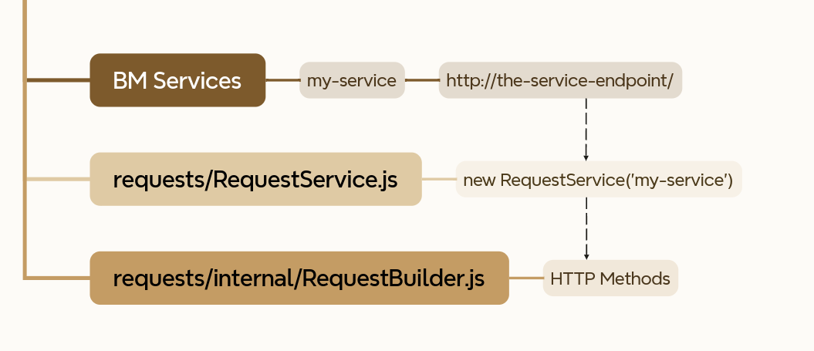

# SFCC Requests

This project is an easy way to make requests in salesforce commerce cloud.

## Usage Flow



- Each _BM Service_ must have an endpoint
- RequestService; loads and handle the _BM Service_
- RequestBuilder; encapsulates the core methods for creating a request

---

## Installation

Download the folder `requests` and put in your cartridge, I recommend put the `requests` folder inside the `scripts`
folder

---

## Request Service

The `RequestService` is the first layer of a request

```js        
const RequestService = require('*/cartridge/<my-cartridge>/scripts/requests/RequestService.js')

const myService = new RequestService("my-service");
if (myService.hasError) { // Check if service has any error
    var err = myService.error // Get the service error message
    // ...
}
// ...
```        

A `RequestService` instance allows you to call a http method, it returns a `RequestBuilder` instance

Supported HTTP Methods:

- GET
- POST
- PATCH
- PUT
- DELETE

---

## RequestBuilder

The `RequestBuilder` is the second layer of the request process

```js
const myService = new RequestService("my-service");
if (myService.hasError) { // Check if service has any error
    var err = myService.error // Get the service error message
    // ...
}

myService.GET("your-endpoint")      // Use this method to create a GET request
myService.POST("your-endpoint")     // Use this method to create a POST request
myService.PATCH("your-endpoint")    // Use this method to create a PATCH request
myService.PUT("your-endpoint")      // Use this method to create a PUT request
myService.DELETE("your-endpoint")   // Use this method to create a DELETE request
```

### About the request final URL

The request URL is `Service URL` + `Endpoint`

Example, your service contains the url `https://localhost/` and you call a GET request to `users`

The result is `https://localhost/users`

### Very simple example of a get Request

```js
const myService = new RequestService("my-service");
if (myService.hasError) { // Check if service has any error
    var err = myService.error // Get the service error message
    // ...
}

const request = myService.GET("your-endpoint")
const response = request.call() // This method performs the request


var status = response.status // Response status
var body = response.body // Response body
var headers = response.headers // Response headers
```

---

### Request Builder Methods

#### Getting information about the request

```js

/**
 * @type {RequestBuilder}
 */
const request = myService.GET("your-endpoint")

// Returns the current URL
request.getURL()

// Returns the current Headers
request.getHeaders()

// Returns the current body
request.getBody()

// Returns the current url query params
request.getQueryParams()

// Returns the current form multiparts (Use it to form)
request.getMultiParts()
```

#### Setting Headers

```js
// Add a header to request headers
request.addHeader('Header', 'Value')

// Or

// Add many headers to request headers
request.setHeaders({
    'Header_1': 'Value_1',
    'Header_2': 'Value_2'
})
```

#### Setting Body

##### Raw Body

```js
// Set a request body
//      The first argument is a string (raw body)
//      The second argument is the Content-Type 
request.setBody("payload", "text/plain")
```

##### JSON Body

```js
// Set a JSON in the request body and add the header Content-Type as application/json
request.setJSON({"first_name": "John", "last_name": "Doe"})
```

##### Working with Forms

```js
// To create a form, use the addMultiPart
const HTTPRequestPart = require('dw/net/HTTPRequestPart')

// Each addMultiPart adds a form field in the current request body
request.addMultiPart(new HTTPRequestPart("first_name", "John")) // field_name and field_value
request.addMultiPart(new HTTPRequestPart("last_name", "Doe"))
```

#### Setting Query Params

```js
// Add the query param to current query params
request.addQueryParam("sort", "desc")

// You can verify the current url using the method `request.getURL()` 
// Example of updated url = https://localhost/users?sort=desc
```

---

### Call function Options

The call function, performs the HTTP request, it has some options.

| Option          | Value   | Description                                                                   |
|-----------------|---------|-------------------------------------------------------------------------------|
| sendAsMultiPart | boolean | Case true, then sends the body as a multipart form                            |
| followRedirect  | boolean | Case true, then follow a HTTP redirect                                        |
| parseResponse   | boolean | Case true, then executes the JSON.parse in the response body                  |
| timeout         | number  | The number of milliseconds to wait for a response (the maximum is 15 minutes) |

Example of a request using options
```js
var response = myRequest.call({
    followRedirect: true, // Follows a HTTP Redirect
    parseResponse: true, // Parse the response body
})

```

---

## Request Content Types

This is an internal helper for creating the Content-Type header

This can be useful to standardize headers, it is inspired by the MediaType class of spring boot

Most MIME types can be found in this helper

### Usage

#### Application JSON

```js
const RequestContentTypes = require('*/cartridge/<my-cartridge>/scripts/requests/internal/RequestContentTypes.js')

var json = RequestContentTypes.JSON().getValue() // Returns application/json
// or
var jsonEncode = RequestContentTypes.JSON().getValueEncoded("UTF-8") // Returns application/json; charset: UTF-8
```

#### Any, Other Types and Custom Mime

```js

RequestContentTypes.ANY_TYPE().getValue()       // Returns */*
RequestContentTypes.OCTET_STREAM().getValue()   // Returns application/octet-stream
RequestContentTypes.PLAIN_TEXT().getValue()     // Returns text/plain

// Or, create a custom MIME

RequestContentTypes.CUSTOM("aaa", "bbb").getValue() // Returns aaa/bbb

```

### Predefined MIME types supported

| NAME                      | CONTENT-TYPE                                                                |
|---------------------------|-----------------------------------------------------------------------------|
| ANY_TYPE                  | `*/*`                                                                       |
| ANY_TEXT_TYPE             | `text/*`                                                                    |
| ANY_IMAGE_TYPE            | `image/*`                                                                   |
| ANY_AUDIO_TYPE            | `audio/*`                                                                   |
| ANY_VIDEO_TYPE            | `video/*`                                                                   |
| ANY_APPLICATION_TYPE      | `application/*`                                                             | 
| CACHE_MANIFEST            | `text/cache-manifest`                                                       |
| CSS                       | `text/css`                                                                  |
| CSV                       | `text/csv`                                                                  |
| HTML                      | `text/html`                                                                 |
| I_CALENDAR                | `text/calendar`                                                             |
| PLAIN_TEXT                | `text/plain`                                                                |
| TEXT_JAVASCRIPT           | `text/javascript`                                                           |
| TSV                       | `text/tab-separated-values`                                                 |
| VCARD                     | `text/vcard`                                                                |
| WML                       | `text/vnd.wap.wml`                                                          |
| XML                       | `text/xml`                                                                  |
| BMP                       | `image/bmp`                                                                 |
| CRW                       | `image/x-canon-crw`                                                         |
| GIF                       | `image/gif`                                                                 |
| ICO                       | `image/vnd.microsoft.icon`                                                  |
| JPEG                      | `image/jpeg`                                                                |
| PNG                       | `image/png`                                                                 |
| PSD                       | `image/vnd.adobe.photoshop`                                                 |
| SVG                       | `image/svg+xml`                                                             |
| TIFF                      | `image/tiff`                                                                |
| WEBP                      | `image/webp`                                                                |
| MP4_AUDIO                 | `audio/mp4`                                                                 |
| MPEG_AUDIO                | `audio/mpeg`                                                                |
| OGG_AUDIO                 | `audio/ogg`                                                                 |
| WEBM_AUDIO                | `audio/webm`                                                                |
| MP4_VIDEO                 | `video/mp4`                                                                 |
| MPEG_VIDEO                | `video/mpeg`                                                                |
| OGG_VIDEO                 | `video/ogg`                                                                 |
| QUICKTIME                 | `video/quicktime`                                                           |
| WEBM_VIDEO                | `video/webm`                                                                |
| WMV                       | `video/x-ms-wmv`                                                            |
| APPLICATION_XML           | `application/xml`                                                           |
| ATOM                      | `application/atom+xml`                                                      |
| BZIP2                     | `application/x-bzip2`                                                       |
| DART                      | `application/dart`                                                          |
| APPLE_PASSBOOK            | `application/vnd.apple.pkpass`                                              |
| EOT                       | `application/vnd.ms-fontobject`                                             |
| EPUB                      | `application/epub+zip`                                                      |
| FORM_DATA                 | `application/x-www-form-urlencoded`                                         |
| KEY_ARCHIVE               | `application/pkcs12`                                                        |
| APPLICATION_BINARY        | `application/binary`                                                        |
| GZIP                      | `application/x-gzip`                                                        |
| JAVASCRIPT                | `application/javascript`                                                    |
| JSON                      | `application/json`                                                          |
| MANIFEST_JSON             | `application/manifest+json`                                                 |
| KML                       | `application/vnd.google-earth.kml+xml`                                      |
| KMZ                       | `application/vnd.google-earth.kmz`                                          |
| MBOX                      | `application/mbox`                                                          |
| APPLE_MOBILE_CONFIG       | `application/x-apple-aspen-config`                                          |
| MICROSOFT_EXCEL           | `application/vnd.ms-excel`                                                  |
| MICROSOFT_POWERPOINT      | `application/vnd.ms-powerpoint`                                             |
| MICROSOFT_WORD            | `application/msword`                                                        |
| OCTET_STREAM              | `application/octet-stream`                                                  |
| OGG_CONTAINER             | `application/ogg`                                                           |
| OOXML_DOCUMENT            | `application/vnd.openxmlformats-officedocument.wordprocessingml.document`   |
| OOXML_PRESENTATION        | `application/vnd.openxmlformats-officedocument.presentationml.presentation` |
| OOXML_SHEET               | `application/vnd.openxmlformats-officedocument.spreadsheetml.sheet`         |
| OPENDOCUMENT_GRAPHICS     | `application/vnd.oasis.opendocument.graphics`                               |
| OPENDOCUMENT_PRESENTATION | `application/vnd.oasis.opendocument.presentation`                           |
| OPENDOCUMENT_SPREADSHEET  | `application/vnd.oasis.opendocument.spreadsheet`                            |
| OPENDOCUMENT_TEXT         | `application/vnd.oasis.opendocument.text`                                   |
| PDF                       | `application/pdf`                                                           |
| POSTSCRIPT                | `application/postscript`                                                    |
| PROTOBUF                  | `application/protobuf`                                                      |
| RDF_XML                   | `application/rdf+xml`                                                       |
| RTF                       | `application/rtf`                                                           |
| SFNT                      | `application/font-sfnt`                                                     |
| SHOCKWAVE_FLASH           | `application/x-shockwave-flash`                                             |
| SKETCHUP                  | `application/vnd.sketchup.skp`                                              |
| TAR                       | `application/x-tar`                                                         |
| WOFF                      | `application/font-woff`                                                     |
| XHTML                     | `application/xhtml+xml`                                                     |
| XRD                       | `application/xrd+xml`                                                       |
| ZIP                       | `application/zip`                                                           |

